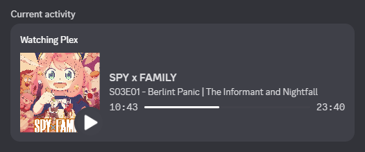
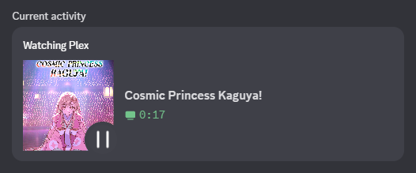
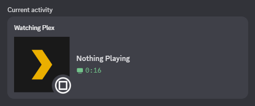

plex-discord-rpc
=====
Discord Rich Presence Integration for [Plex Desktop](https://www.plex.tv/en-ca/media-server-downloads/?cat=plex+desktop#plex-app), Edited for Plex by Glitchtest51, originally made by tnychn and updated by CosmicPredator.

  
  
  

  <b>Left:</b> Playing a Episode
   
  <b>Right:</b> Paused in Movie
   
  <b>bottom:</b> On home menu, not playing anything

## Features

* 🛠 Easy configuration
* 📦 No third-party dependencies
* 🚸 Simple installation (installer scripts included)
* 🏁 Cross-platform (embrace my beloved Golang!)
* ⏳ Displays real time player state and timestamps
* 🔕 Toggle activation on the fly by key binding
* 👻 Automatically hide when player is paused
* 🖼 Customizable image assets

## Installation

Installer scripts for Windows, Linux and OSX are provided.

1. Download .zip from [the latest release](https://github.com/Glitchtest51/plex-discord-rpc/releases) and extract it.
2. Run the installer script of your platform.
    * **MacOS**: not sure, pr or issue if you know
    **Linux**: not sure, pr or issue if you know
    * **Windows**: run `install_windows.bat` by double clicking on it for Windows

## Configurations

For OSX and Linux, config file is located in `not sure, pr or issue if you know`.

For Windows, config file is located at `%localappdata%\Plex\script-opts`.

* **key** (default: `D`): key binding to toggle activation on the fly
* **active** (default: `yes`): whether to activate at launch
* **client_id**: specify your own client ID to [customize](#customization) the images shown in Rich Presence
* **autohide_threshold** (default: `0`): time in seconds before hiding the presence once player is paused (`0` is off)

## Customization

Go to [Discord Developer Portal](https://discord.com/developers/applications),
create an application and upload the following art assets with their corresponding asset keys:
* `mpv`: large image (app logo)
* `play`: small image used when playing
* `pause`: small image used when paused
* `stop`: small image used when idle

Then, set the `client_id` option in the config to the application ID.

You can also find the already provided client ids and their image assets [here](./assets/).

## Contributing

If you have any ideas on how to improve this project or if you think there is a lack of features,
feel free to open an issue, or even better, open a pull request. All contributions are welcome!

---

  <strong>~ crafted with ♥︎ by tnychn, CosmicPredator & Glitchtest51 ~</strong>
   
  <strong>MIT © 2024 tnychn, Cosmic Predator & Glitchtest51</strong>

